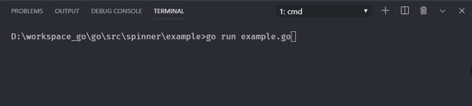

# A simple Spinner with configurable speed and duration



## Example

```go
package main

import (
    "time"

    "github.com/akshaybharambe14/spinner"
)

func main() {
    s := spinner.New(spinner.Default, 5, spinner.NoDuration)

    q := make(chan struct{})
    go func() {
        // work
        time.Sleep(time.Second * 5)
        // end
        q <- struct{}{}
    }()
    s.Start(q)
}

```
